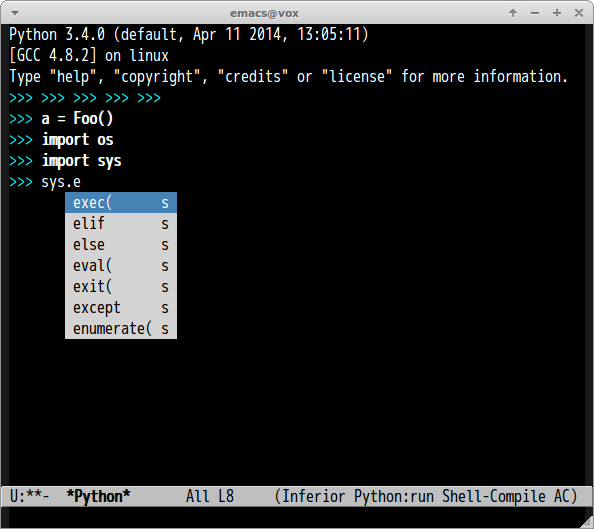

# ac-capf.el

[auto-complete](https://github.com/auto-complete/auto-complete) source for `completion-at-point`.
Most code is taken from [company-mode](https://github.com/company-mode/company-mode).

This auto-complete source is useful in REPL buffer like `inferior-python-mode` etc.


## Screenshot




## Command

#### `ac-capf-setup`

Set up the auto-complete source and enable `auto-complete-mode`.


## Sample Configuration

```lisp
(add-hook 'inferior-python-mode-hook 'ac-capf-setup)
```
